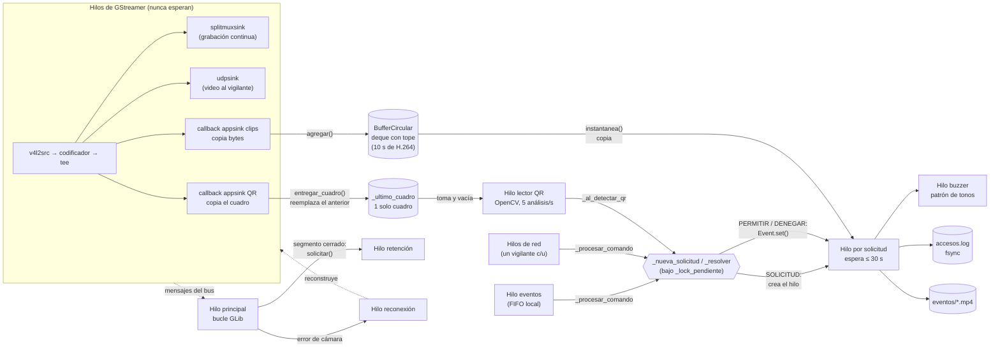

# H1 — Arquitectura de hilos

**Ítem del acta:** *La decisión de acceso corre fuera del hilo de GStreamer. El
pipeline no puede quedar esperando a un clasificador.*

**Respuesta corta:** los hilos de GStreamer nunca esperan a nadie. Lo único que
hacen fuera de la tubería es copiar bytes en los callbacks de los appsink y
retornar. El clasificador (el lector de QR), la espera de la decisión del
vigilante, la bitácora y la escritura de los clips corren en hilos propios, y
se comunican con GStreamer solo por estructuras de las que GStreamer escribe y
nunca lee: un búfer de un cuadro para el QR y una deque con tope para los
clips.

Las referencias a líneas son de la rama `Isaac` al 2026-10-02.

---

## 1. Los hilos

| # | Hilo | Qué hace | Dónde se crea | ¿Puede bloquearse? | ¿Afecta al video si se bloquea? |
|---|---|---|---|---|---|
| 1 | Principal (bucle de GLib) | Atiende los mensajes del bus de GStreamer (error, warning, EOS, segmento cerrado) y las señales SIGINT/SIGTERM | `servicio.py:154` (`self._bucle.run()`) | No: cada manejador solo registra o despierta a otro hilo | No |
| 2 | Streaming de GStreamer (uno por `queue`) | Captura, decodifica, codifica, transmite y graba. Ejecuta los callbacks de los dos appsink | GStreamer, al pasar a PLAYING | **No debe**: es lo que este ítem protege | — |
| 3 | Eventos (FIFO) | Lee comandos locales de `/tmp/acceso-eventos` | `servicio.py:145` → `_escuchar_eventos` (`:162`) | Sí, esperando una línea | No |
| 4 | Red (uno por vigilante) | Lee comandos TCP y responde OK/ERROR | `red.py:84` (`serve_forever`, que crea uno por cliente) | Sí, esperando una línea del socket | No |
| 5 | Uno por solicitud | Espera la decisión o el vencimiento, activa el buzzer, anota la bitácora y escribe el clip | `servicio.py:274` → `_atender` (`:299`) | **Sí, hasta 30 s** esperando al vigilante, y 5 s más esperando el video posterior del clip | No |
| 6 | Lector QR | Toma el último cuadro, lo reduce a 640 px y lo analiza con OpenCV | `lector_qr.py:74` → `_bucle` (`:86`) | Sí: cada análisis tarda ~15 ms en x86 y más en la RPi | **No** (ver §3) |
| 7 | Retención | Borra los archivos más viejos cuando una carpeta supera su tope | `retencion.py:158` → `_bucle` (`:169`) | Sí, recorriendo y borrando archivos | No |
| 8 | Buzzer (uno por indicación) | Reproduce el patrón de tonos escribiendo en `/sys/class/pwm` | `actuador.py:195` → `_reproducir` (`:221`) | Sí, durmiendo entre tonos (~1 s en total) | No |
| 9 | Reconexión | Tras un error de la cámara, libera y reconstruye la tubería cada 5 s | `servicio.py:583` → `_reconectar` (`:585`) | Sí, entre reintentos | Es el que la restablece (E3) |

Todos son `daemon`, salvo el principal y los de GStreamer.

---

## 2. Diagrama

Las flechas que **salen** de GStreamer terminan en una estructura de datos
(la deque o el búfer de un cuadro), nunca en otro hilo. Ninguna flecha entra a
GStreamer salvo la reconexión, que solo actúa cuando la tubería ya falló.

---

## 3. Por qué GStreamer nunca espera al clasificador

**El callback del QR no analiza nada** (`pipeline.py:198`,
`_al_llegar_cuadro_qr`). Mapea el buffer, copia el cuadro a un arreglo de
NumPy, lo deja en `_ultimo_cuadro` (`lector_qr.py:67`) y retorna. El análisis
con OpenCV ocurre en el hilo 6.

**Si el lector va atrasado, se descartan cuadros en lugar de acumularlos.**
Hay tres topes en cadena, y los tres descartan:
1. `queue max-size-buffers=1 leaky=downstream` en la rama de QR.
2. `appsink max-buffers=1 drop=true`.
3. `_ultimo_cuadro` guarda un solo cuadro: el nuevo reemplaza al anterior sin
   esperar a que se analice.

Así, aunque OpenCV tarde 1 s o se cuelgue del todo, el callback sigue
retornando de inmediato y el resto de la tubería no se entera. El lector
siempre analiza el cuadro más reciente: un QR de hace dos segundos ya no
sirve.

**Lo mismo con los clips.** El callback de clips (`pipeline.py:179`) solo copia
los bytes a la deque (`buffer_circular.py:76`), que tiene `maxlen` y descarta
lo más viejo. La escritura del clip la hace el hilo 5, que antes toma una
copia de la deque (`instantanea()`, `:89`).

**Lo que queda dentro de un callback** son operaciones de memoria: un `map`, una
copia y tomar un candado que nadie retiene más que unos microsegundos. El
tiempo de esos callbacks se mide en B5.

---

## 4. La decisión de acceso y su plazo (H1 + H2)

La decisión no la toma ningún hilo de GStreamer:

1. **Se abre una solicitud** desde el FIFO, la red o el lector QR. En los tres
   casos se llama a `_nueva_solicitud` (`servicio.py:258`), que crea un
   `SolicitudAcceso` y lanza el hilo 5.
2. **El hilo 5 espera** en `SolicitudAcceso.esperar()` (`decision.py:104`),
   que es un `threading.Event.wait(30 s)`. Es el único hilo que espera al
   vigilante, y hay uno por solicitud.
3. **El vigilante responde** desde el hilo de red: `_resolver`
   (`servicio.py:280`) llama a `SolicitudAcceso.resolver()`, que hace
   `Event.set()` y despierta al hilo 5.
4. **Si nadie responde**, `wait` vence, la solicitud se cierra como
   `VENCIDO` y un `PERMITIR` tardío se rechaza (`decision.py:104-125`).

Una credencial de vigilante o mantenimiento pasa por el mismo camino: el
lector abre la solicitud y la resuelve de inmediato (`servicio.py:515`). Así
la bitácora, el buzzer y el clip funcionan igual sin importar quién decidió.

---

## 5. Puntos de sincronización

| Primitiva | Archivo | Qué protege | Quién la usa |
|---|---|---|---|
| `_lock_pendiente` | `servicio.py:109` | Que haya **una sola** solicitud pendiente y que resolver y liberar ocurran juntos | Hilos de red, eventos, lector QR (abren o resuelven) y 5 (libera al vencer) |
| `SolicitudAcceso._evento` | `decision.py:87` | La espera de la decisión con plazo | Hilo 5 espera; red, eventos o lector QR la despiertan |
| `SolicitudAcceso._cierre` | `decision.py:88` | La carrera entre un `PERMITIR` y el vencimiento en el mismo instante | `resolver()` y `esperar()` |
| `BufferCircular._lock` | `buffer_circular.py:64` | La deque de cuadros comprimidos | Callback de clips (escribe), hilo 5 (copia) |
| `LectorQR._lock` | `lector_qr.py:56` | El búfer de un cuadro | Callback QR (escribe), hilo 6 (toma y vacía) |
| `Bitacora._lock` | `decision.py:52` | Que dos solicitudes no mezclen sus líneas en `accesos.log` | Hilos 5 |
| `RegistroCredenciales._lock` | `registro.py:95` | `credenciales.json` | Hilos de red y eventos (ALTA, BAJA, LISTAR), lector QR (buscar) |
| `_lock_imagenes` | `servicio.py:73` | Que un `ALTA` no genere su imagen mientras `REGENERAR_QR` vacía la carpeta | Hilos de red y eventos |
| `ServidorDecisiones._lock` | `red.py:72` | La lista de vigilantes conectados y que una respuesta y un aviso no mezclen bytes en el socket | Hilos de red y quien difunde avisos |
| `IndicadoresAcceso._lock` + número de generación | `actuador.py:181` | Que una indicación nueva reemplace a la que suena sin que dos patrones se mezclen | Hilos 8 |
| `Retencion._despertar` | `retencion.py:152` | Despertar la limpieza al cerrar un segmento o un clip (y cada 60 s de respaldo) | Hilo principal y 5 lo activan, hilo 7 espera |

**Ningún hilo de GStreamer toma un candado que otro hilo pueda retener
durante mucho tiempo.** Los dos candados que comparte con otros hilos
(`BufferCircular._lock` y `LectorQR._lock`) solo se retienen mientras se
agrega, se copia o se reemplaza una referencia.

---

## 6. Verificación

- **Inspección de código:** las tablas anteriores, con archivo y línea.
- **Prueba (pendiente, en la placa):** la que el acta llama "clasificador
  colgado". Se agrega un `time.sleep(120)` temporal dentro de
  `LectorQR._analizar` y se verifica que:
  1. el video sigue llegando al receptor;
  2. los segmentos de `evidencia/` siguen creciendo;
  3. una `SOLICITUD` sin respuesta vence a los 30 s y queda como
     `denegado_por_vencimiento` en la bitácora.

  Esa misma prueba cierra la parte de H2 que falta.
